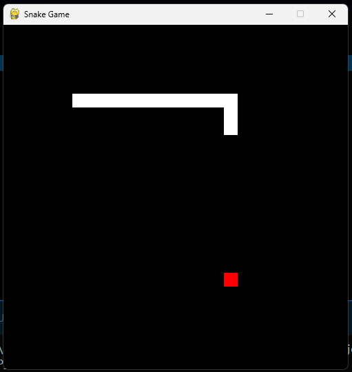

# Snake_Game
 The classic game of snake in Python.

Setting up Locally:
- Download the 'Snake_Game' folder to your local computer.
- Run the file 'main.py' in terminal.
- Use the arrow keys to move the snake.
 
## Snapshots:

1. Gameplay:

